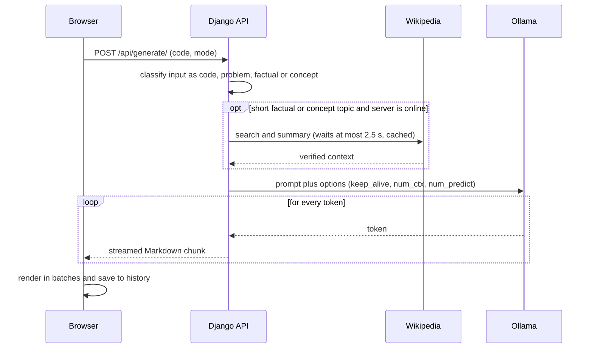

<!--
  Screenshots are hosted on the `docs-assets` branch (screenshots/*.jpg) instead of in this branch,
  because Hugging Face Spaces rejects binary files in pushes. Do not merge docs-assets into main.
-->

# 📝 DocGen - AI Documentation Generator

DocGen turns source code, algorithm problems and plain topics into structured, professional
documentation, streamed back as you watch and exportable as **PDF** or **DOCX**.

It pairs a React frontend and a Django REST backend with **Ollama** running the
**Qwen2.5-Coder** model locally, so there is no OpenAI / Gemini / paid-API dependency and your
code never leaves the machine that runs it.

<p align="center">
  
</p>

**Live demo:** [huggingface.co/spaces/docgen/DocGen](https://huggingface.co/spaces/docgen/DocGen)
(use **Try demo account** on the login page)

**Contents:**
[Tour](#-tour) ·
[How it works](#-how-it-works) ·
[Features](#-features) ·
[Performance](#-performance) ·
[Run locally](#-run-locally) ·
[Docker / Hugging Face](#-docker--hugging-face-spaces) ·
[API](#-api) ·
[Theme](#-theme) ·
[Production notes](#-production-notes) ·
[Troubleshooting](#-troubleshooting)

---

## 🖼 Tour

The images below are screenshots of the production build. The documentation you see in them is
**real output** from the live Space (`qwen2.5-coder:3b`, Quick mode), generated from the small
`divide(a, b)` function shown in the prompt.

### 1. Sign in

<p align="center">
  
</p>

Create an account, sign in, or press **Try demo account** for an instant look around. Sessions use
JWT tokens (valid for one day). The light/dark toggle in the corner is remembered between visits.

### 2. Write a prompt

The workspace is built around one glass **Prompt** card. Paste code, type a topic such as
*"binary search"*, or upload a file.

| Control | What it does |
| --- | --- |
| **+** | Upload a source/text file (up to 200 KB: `.py .js .ts .java .c .cpp .go .rs .sql .md .txt ...`). Its contents fill the prompt. |
| **⚡ Quick** (yellow) | Toggles **Quick** vs **Detailed** output. Quick is on by default and your choice is remembered. See [Performance](#-performance). |
| **🎤** | Voice dictation. Speech is typed into the prompt (Chrome, Edge and Safari; disabled where the browser has no Web Speech API). |
| **→** | Generate. `Ctrl + Enter` (or `Cmd + Enter`) does the same from the keyboard. Input is capped at 6,000 characters. |

The left sidebar lists your previous documents (open or delete them) and shows the connection
status. On phones it becomes a slide-over drawer.

### 3. Watch it generate

<p align="center">
  
</p>

The answer **streams in** as Markdown, so you can start reading immediately. While it runs:

- the prompt card docks to the bottom and its arrow turns into a **Stop** button (the partial
  document is kept if you stop);
- the **Copy / DOCX / PDF** buttons are disabled until the document is complete;
- pressing Stop also stops the model on the server (as soon as it produces its next token), so it
  doesn't keep generating a document nobody is reading and slow down the next request.

### 4. Read, copy and export

<p align="center">
  
</p>

- Documents are rendered with headings, lists, tables and **syntax-highlighted code blocks**, each
  with its own *Copy* button.
- **Copy** puts the whole document on the clipboard as Markdown; **DOCX** and **PDF** download a
  formatted file (generated with python-docx and ReportLab).
- Finished documents are saved to your **History** automatically. Failed generations are never saved.
- Code input is documented with the sections *Overview, Parameters / Inputs, Returns / Outputs,
  Usage Example, Complexity & Edge Cases*, as shown above.

### 5. Light, dark and mobile

<p align="center">
  
</p>

<table align="center">
  <tr>
    <td align="center"></td>
    <td align="center"></td>
  </tr>
</table>

The dark theme keeps the same layout on a deep aurora background. The whole app is responsive, and
animations respect the *reduce motion* setting of your operating system.

---

## ⚙️ How it works



1. **Classify.** The backend inspects the input: *code* (symbols, keywords or several lines),
   *problem* (algorithm vocabulary such as "array" or "subarray"), *factual* ("who", "when",
   "population"...) or *concept* (anything else).
2. **Ground (optional).** Short factual/concept topics are enriched with a Wikipedia summary when the
   server is online, and the model is told to copy facts and numbers exactly. Code and problems never
   trigger a lookup. If Wikipedia is slow (over 2.5 s) or unreachable, generation simply continues
   without it.
3. **Prompt.** A template matched to the input type is used: code gets the section list above,
   problems get *Problem Statement, Approach, Algorithm Steps, Complexity, Example*, and concepts get
   a structured explanation. Quick mode adds "be concise"; Detailed mode asks for depth and edge cases.
4. **Stream.** Ollama's tokens are forwarded to the browser as they are produced. The browser batches
   re-renders (about 11 per second) so long documents stay smooth.
5. **Save and export.** When the stream ends the document is saved to your history. DOCX and PDF are
   rendered on demand from the Markdown.

```text
Browser (React + Tailwind)
   │  fetch /api/...  (JWT)
   ▼
Django REST API (gunicorn, gthread)
   ├── auth, history, status
   ├── POST /api/generate/ ──► Ollama (qwen2.5-coder:3b, kept warm) ──► streamed Markdown
   │        └─ optional Wikipedia grounding (short factual topics only)
   └── POST /api/pdf/ | /api/docx/ ──► ReportLab / python-docx ──► file download
```

The Django server also serves the compiled React app from `frontend/build`, so one container
exposes everything on port 7860.

---

## ✨ Features

- **Paste or upload** code or just type a topic
- **Quick / Detailed modes** - the yellow ⚡ button trades depth for speed
- **Live streaming** output rendered as Markdown with syntax-highlighted code blocks
- **Voice dictation** in browsers that support the Web Speech API
- **Export** any document as PDF or DOCX, or copy it as Markdown
- **History** per user, with open / delete
- **JWT authentication** (SimpleJWT) plus a one-click demo account
- **Light & dark themes**, aurora gradient + frosted-glass UI, fully responsive
- **Local LLM** - generation runs on Ollama next to the app, no paid API

## 🧰 Tech stack

| Layer | Technology |
| --- | --- |
| Frontend | React 19, Tailwind CSS 3, Framer Motion, react-markdown, react-syntax-highlighter (Prism light) |
| Backend | Django, Django REST Framework, SimpleJWT, WhiteNoise, gunicorn |
| AI | Ollama + Qwen2.5-Coder (3B by default) |
| Exports | ReportLab (PDF), python-docx (DOCX) |
| History | Firestore (per-user document history) and a Django `DocHistory` table |

---

## ⚡ Performance

Generation speed was the focus of the latest update. What changed:

| Area | Before | Now |
| --- | --- | --- |
| Model loading | Unloaded after 5 idle minutes, so the next request paid a cold start | `keep_alive` = 24h **and** the model is pre-loaded at container start |
| Request start-up | A 2 s network probe on every request and `/status` poll | Probe cached for 30 s |
| Wikipedia | Looked up for any short input, including code; no time limit | Only for short factual/concept topics; waits at most 2.5 s; results cached |
| Prompt size | Full Wikipedia article (6000 chars) | 3000-char summary; user input capped at 6000 chars |
| Output length | Unbounded | **Quick mode** caps output and asks for a concise doc; Detailed allows up to 2048 tokens |
| Stop button | Closed the browser stream only - Ollama kept generating and slowed the next request | Closes the upstream connection so Ollama stops as soon as the next token is produced |
| Browser start of request | Waited on a Firestore write before calling the API | API call starts immediately; history is saved after the stream |
| Rendering | Re-parsed the whole Markdown on every token | Batched to ~11 renders/s and memoised |
| JS bundle | 566 kB gzip (all Prism languages) | 383 kB gzip (only the languages DocGen registers) |
| Container start | Fixed `sleep 5`, sequential pull -> migrate | Waits for Ollama to be ready, pulls only if missing, warms the model **in parallel** with Django setup |

### What to expect

Measured on 2026-10-05 against the live Space on Hugging Face's free **`cpu-basic`** hardware
(2 vCPU), using the example above:

| Mode | Time to first token | Whole document |
| --- | --- | --- |
| Quick | about 1-2 s once warm (5-8 s on the very first request) | roughly 1-2 minutes |
| Detailed | 4-13 s | roughly 3-4 minutes |

That is about **2-3 tokens per second**: on a 2-vCPU CPU the 3B model's raw generation speed is
the limit, and the changes above remove the *avoidable* delays around it. To go meaningfully faster,
use a smaller model (e.g. `qwen2.5-coder:1.5b`, trading some quality) or faster Space hardware
(`cpu-upgrade` or a GPU); on a local machine with a GPU it is far quicker.

Two details worth knowing if you tune this yourself:

- `num_ctx` is deliberately identical for Quick and Detailed (and for the warm-up call).
  Ollama **reloads the model whenever `num_ctx` changes** between requests, which would erase the benefit of warming.
- `OLLAMA_NUM_PARALLEL=1` is set because on CPU, parallel generations just split the same cores
  and make every request slower. It also means requests queue, so a very busy public Space can
  feel slow for the next person in line.

---

## 📂 Project structure

```text
DocGen/
├── backend/
│   ├── backend/                # Django project (settings, urls, wsgi/asgi)
│   ├── generator/
│   │   ├── views.py            # auth, history, streaming generation, downloads
│   │   ├── pdf_generator.py    # Markdown -> PDF (ReportLab)
│   │   ├── docx_generator.py   # Markdown -> DOCX (python-docx)
│   │   ├── models.py           # DocHistory
│   │   ├── urls.py
│   │   └── tests.py            # backend test suite (21 tests)
│   ├── users/
│   └── manage.py
├── frontend/
│   ├── public/                 # index.html, favicon.svg, manifest.json
│   ├── src/
│   │   ├── App.js              # state, streaming, routing, layout
│   │   ├── index.css           # theme tokens, aurora, glass components
│   │   ├── firebase.js
│   │   └── components/
│   │       ├── PromptCard.js   # the glass prompt: upload, quick mode, mic, submit
│   │       ├── DocView.js      # Markdown rendering + code blocks + exports
│   │       ├── Sidebar.js      # history, user, connection status
│   │       ├── AuthPage.js     # login / register
│   │       └── InfoPages.js    # About and Contact
│   ├── build/                  # production build (committed on purpose; served by Django)
│   ├── tailwind.config.js
│   └── package.json
├── Dockerfile
├── entrypoint.sh               # starts Ollama, warms the model, runs migrations + gunicorn
├── requirements.txt            # used by the Dockerfile (backend/requirements.txt is an older copy)
├── .dockerignore               # must NOT exclude frontend/build (the image doesn't run npm)
├── start.sh                    # legacy start script, not used by the Dockerfile
└── README.md
```

---

## 🚀 Run locally

**Prerequisites:** Python 3.10+, Node.js 18+, and [Ollama](https://ollama.com).

### 1. Get the code and the model

```bash
git clone https://github.com/SanjayMarathi/DocGen.git
cd DocGen

ollama pull qwen2.5-coder:3b
ollama serve                      # http://localhost:11434
```

### 2. Backend

```bash
python -m venv venv
source venv/bin/activate          # Windows: .\venv\Scripts\activate
pip install -r requirements.txt

cd backend
python manage.py migrate
python manage.py runserver 8000   # http://127.0.0.1:8000
```

### 3. Frontend

Development server with hot reload (API calls are proxied to Django on port 8000):

```bash
cd frontend
npm install
npm start                         # http://localhost:3000
```

Or build once and let Django serve the app on port 8000:

```bash
npm run build
```

> The production build is committed to the repository because the Docker image does not run
> `npm`. After changing the frontend, rebuild with `CI=false GENERATE_SOURCEMAP=false npm run build`
> and commit the result (`git add -f frontend/build`, as the folder is git-ignored by default).

### 4. Try it

Create an account, paste some code, press **Ctrl + Enter** or the arrow button. (The `demo` /
`demouser` account is only created by the Docker entrypoint.)

### Tests

```bash
cd backend
python manage.py test generator
```

The suite mocks Ollama and covers input detection, Quick/Detailed options, the cached internet
check, Wikipedia gating and timeouts, streaming, history saving, error handling and stop-generation cleanup.

---

## 🐳 Docker / Hugging Face Spaces

The Space is built from the `Dockerfile` (SDK: `docker`, port `7860`). On start, `entrypoint.sh`:

1. starts Ollama,
2. in the background, waits for it, pulls the model **only if it is missing**, then warms it into memory,
3. meanwhile runs migrations, `collectstatic` and creates the `demo` user,
4. waits for the model to be ready, then starts gunicorn (2 workers x 4 threads).

```bash
docker build -t docgen .
docker run -p 7860:7860 docgen    # http://localhost:7860
```

> Hugging Face rejects binary files in pushes, which is why the screenshots in this README live on
> the separate `docs-assets` branch rather than in the repository tree.

### Configuration

| Variable | Default | Purpose |
| --- | --- | --- |
| `OLLAMA_MODEL` | `qwen2.5-coder:3b` | Default model for generation (a request may only override it with a model listed in `ALLOWED_MODELS` in `views.py`) |
| `OLLAMA_URL` | `http://localhost:11434/api/generate` | Ollama generate endpoint |
| `OLLAMA_KEEP_ALIVE` | `24h` | How long Ollama keeps the model in memory |
| `OLLAMA_NUM_CTX` | `6144` | Context window; keep it the same everywhere (see Performance) |

---

## 🔌 API

All `/api/` endpoints except register, login and status need `Authorization: Bearer <access token>`.

| Method | Endpoint | Description |
| --- | --- | --- |
| POST | `/api/register/` | Create an account `{username, password}` |
| POST | `/api/login/` | Returns `{access, refresh}` JWTs |
| GET | `/api/user/` | Current user |
| GET | `/api/status/` | Server reachability |
| POST | `/api/generate/` | Stream documentation. Body: `{code, mode?: "quick" \| "detailed", model?}` |
| GET | `/api/history/` | Server-side history |
| DELETE | `/api/history/<id>/delete/` | Delete a history entry |
| POST | `/api/pdf/` | `{docs}` -> PDF file |
| POST | `/api/docx/` | `{docs}` -> DOCX file |

`/api/generate/` responds with a `text/plain` stream of Markdown. Headers: `X-Doc-Id` (history row)
and `X-AI-Warning` (`online` when Wikipedia grounding was used). If the model fails mid-stream, the
stream ends with the marker `[[DOCGEN_ERROR]] <message>`, which the frontend turns into an error banner.

---

## 🎨 Theme

The UI uses a soft aurora gradient (peach, teal, sage, taupe), frosted-glass surfaces, small
rounded icon buttons and a single yellow accent. All colours are tokens at the top of
[`frontend/src/index.css`](frontend/src/index.css) (`--a0..--a4` for the aurora, `--accent`, `--ink`,
glass and chip tokens) with a dark variant under `html.dark`, so re-theming is a matter of editing
those values. Animations respect `prefers-reduced-motion`.

---

## 🔒 Production notes

The defaults suit a public demo. Before running DocGen for real users, review these:

- `backend/backend/settings.py` has `DEBUG = True` and a development `SECRET_KEY` committed to the
  repository. Set `DEBUG = False` and load a fresh secret key from the environment.
- `CORS_ALLOW_ALL_ORIGINS = True` is enabled. The app is served from the same origin as its API, so
  you can restrict `CORS_ALLOWED_ORIGINS` to your own domain(s).
- The `demo` / `demouser` account is created automatically by `entrypoint.sh`. Remove that line for
  a private deployment.
- The Firebase web config in `frontend/src/firebase.js` is public by design; protect your data with
  Firestore security rules.

---

## 🛠 Troubleshooting

| Symptom | Fix |
| --- | --- |
| "Model not responding" | Is Ollama running? `ollama list` should show `qwen2.5-coder:3b`; if not, `ollama pull qwen2.5-coder:3b` |
| First request is slow | The model is loading. Keep Ollama running and don't lower `OLLAMA_KEEP_ALIVE`; the container warms it at start |
| Every request seems to reload the model | `OLLAMA_NUM_CTX` must be identical for the backend and any warm-up call, otherwise Ollama reloads the model |
| Generation takes minutes | Expected on a 2-vCPU CPU with the 3B model; see [What to expect](#what-to-expect) for ways to speed it up |
| Frontend can't reach the API in dev | Run Django on port 8000 (the dev proxy points there) |
| Blank page after a Docker build | Make sure `.dockerignore` does not exclude `frontend/build` |
| Mic button disabled | The browser doesn't support the Web Speech API; use Chrome/Edge/Safari |
| Documents get cut off | That's Quick mode's length cap - toggle the ⚡ button to Detailed |

## 🗺 Roadmap

- Multiple output templates (README, API reference, docstrings)
- Choice of model size per request
- Role-based access control
- Persisting generated documents server-side as the single source of truth

---

Made by [Sanjay Marathi](https://github.com/SanjayMarathi). Contact: docgenindia@gmail.com
